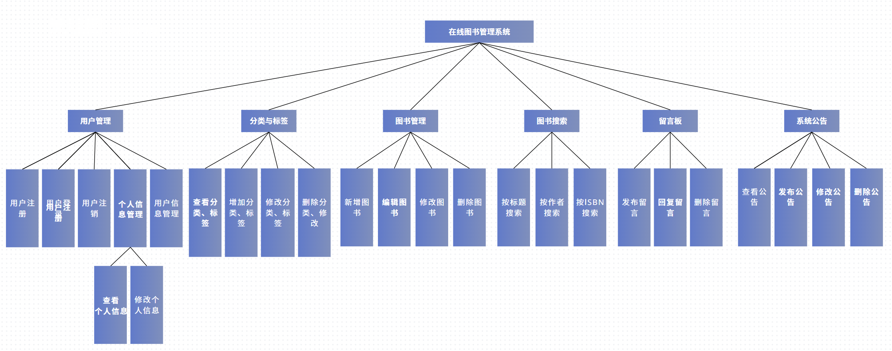
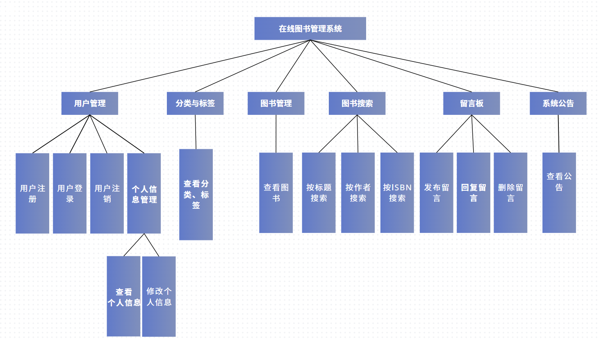

# 图书管理系统设计文档

> **学院：省级示范性软件学院**
>
> **课程：JavaWeb**
>
> **姓名：唐玉亮**
>
> **学号：2100230021**
>
> **班级：软工2202**
>
> **日期：2024-11-23**

## 1. 概述

本系统设计文档为图书管理系统的开发提供技术支持，详细描述了系统的总体架构、模块设计、数据库设计以及安全机制。目标是实现一个面向读者和管理员的高效图书管理平台，帮助用户便捷地进行图书查询、管理和互动。

## 2. 系统架构

系统采用 B/S（浏览器/服务器）架构，基于 Java + Spring Boot + Vue 的技术栈进行开发，采用前后端分离的设计，保证系统的可扩展性和高性能。

### 2.1 技术栈

- **前端**：Vue 3、Element Plus、Axios、Router
- **后端**：Spring Boot、Spring Security、JWT、Mybatis
- **数据库**：MySQL
- **其他**：Redis（用于缓存用户会话数据）、Nginx（用于反向代理）

### 2.2 模块划分

系统由以下主要模块组成：

1. **用户管理模块**：包括用户注册、登录、个人信息管理等功能。
2. **图书管理模块**：管理员对图书信息进行 CRUD 操作。
3. **分类与标签模块**：对图书进行分类和标签管理。
4. **图书搜索模块**：支持按书名、作者、ISBN、分类、标签等多条件搜索。
5. **读者留言板模块**：用户可对图书留言、回复其他留言。
6. **系统公告模块**：管理员发布系统公告。

管理员用户端：

读者用户端：

## 3. 数据库设计

### 3.1 数据库概述

数据库采用 MySQL 进行设计，包含用户、图书、分类、标签、留言和公告等主要数据表，确保系统功能的实现与数据的完整性。

### 3.2 数据表设计

1. **用户表（users）**
   - `id`：主键，自增
   - `username`：用户名，唯一
   - `password`：密码（加密存储）
   - `nickname`：昵称
   - `email`：邮箱
   - `role`：用户角色（reader/admin）
   - `userPic`：用户头像
2. **图书表（books）**
   - `book_id`：主键，自增
   - `title`：书名
   - `author`：作者
   - `isbn`：ISBN 编号
   - `publish_date`：出版日期
   - `category_id`：分类 ID（外键）
   - `description`：图书简介
3. **分类表（categories）**
   - `category_id`：主键，自增
   - `name`：分类名称
4. **标签表（tags）**
   - `tag_id`：主键，自增
   - `name`：标签名称
5. **图书标签关联表（book_tags）**
   - `book_id`：图书 ID（外键）
   - `tag_id`：标签 ID（外键）
6. **留言表（comments）**
   - `comment_id`：主键，自增
   - `user_id`：用户 ID（外键）
   - `content`：留言内容
   - `parent_id`：父留言 ID（用于嵌套回复）
   - `create_time`：创建时间
7. **公告表（notices）**
   - `notice_id`：主键，自增
   - `name`：公告标题
   - `content`：公告内容
   - `create_time`：创建时间

## 4. 详细设计

### 4.1 用户管理模块

- **用户注册**：提供注册接口，用户输入用户名、密码、邮箱等信息，后端进行数据校验并保存。
- **用户登录**：使用 JWT 进行认证，用户登录后生成 Token，Token 存储于 Redis，确保会话安全。
- **个人信息管理**：用户可以修改昵称、邮箱和密码，上传头像。

### 4.2 图书管理模块

- **图书信息管理**：管理员可以对图书进行增、删、改、查操作，包括图书的基本信息和封面。
- **数据验证**：在新增或修改图书时，验证 ISBN 的唯一性，避免重复。

### 4.3 分类与标签模块

- **分类管理**：管理员可以添加、删除和修改图书分类。
- **标签管理**：支持为图书添加多个标签，用户可以通过标签查找感兴趣的图书。

### 4.4 图书搜索模块

- **搜索功能**：支持按标题、作者、ISBN、分类和标签等多条件组合搜索。
- **分页功能**：使用 MyBatis 的分页插件，支持分页查询，提高响应效率。

### 4.5 读者留言板模块

- **留言功能**：用户可以对图书进行留言，其他用户可以回复留言。
- **删除留言**：用户可以删除自己的留言，管理员可以删除任何留言，确保平台内容健康。
- **嵌套回复**：支持留言嵌套回复，用户之间可以互动交流。

### 4.6 系统公告模块

- **公告管理**：管理员可以发布、修改、删除系统公告。
- **公告查看**：所有用户都可以查看公告，获取系统最新动态。

## 5. 安全设计

### 5.1 身份认证与权限控制

- **身份认证**：采用 JWT（JSON Web Token）进行用户身份认证，登录成功后生成 Token，前端每次请求时携带 Token 验证身份。
- **权限控制**：基于 Spring Security 实现细粒度的权限控制，不同角色（读者和管理员）具有不同的访问权限。
- **路由守卫**：前端使用路由守卫，在进入特定页面前判断用户角色，确保只有管理员能进入管理页面。

### 5.2 数据安全

- **密码加密**：用户密码在数据库中进行加密存储，确保数据安全。
- **防止 SQL 注入**：使用 MyBatis 的参数化查询，避免 SQL 注入攻击。
- **敏感数据保护**：用户密码等敏感信息在响应中使用 `@JsonIgnore` 进行隐藏，确保数据不会泄露。

## 6. 接口设计

- **用户相关接口**：用户注册、登录、个人信息更新等。
- **图书管理接口**：图书的增删改查接口，支持分类和标签的查询。
- **留言板接口**：新增留言、回复留言、删除留言。
- **公告接口**：发布公告、删除公告、获取公告列表。

## 7. 部署架构

系统采用分布式部署方案，使用 Nginx 作为反向代理服务器，后端使用 Spring Boot 部署在服务器上，数据库使用 MySQL 进行持久化存储，Redis 用于缓存和存储会话数据，以提高系统性能。

## 8. 总结

图书管理系统通过 Spring Boot 与 Vue 结合实现了前后端分离的高效架构，功能模块清晰，包含用户管理、图书管理、留言板及公告等主要功能。通过 JWT 和 Spring Security 实现身份认证与权限管理，保证系统的安全性和数据完整性。系统还具备高性能、易扩展和易维护的特点，为用户提供良好的图书管理体验。