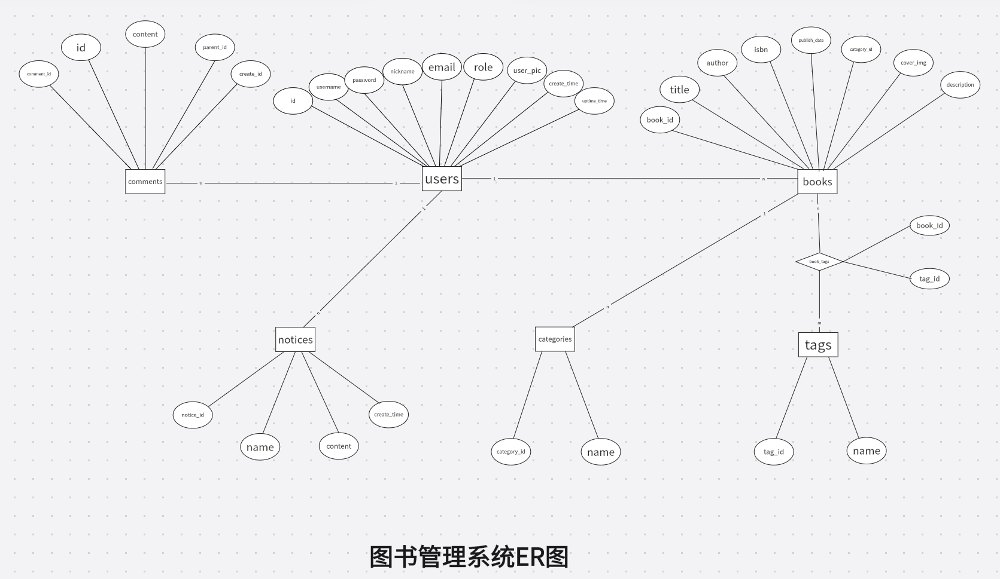

# 数据库设计文档

> **学院：省级示范性软件学院**
>
> **课程：JavaWeb**
>
> **姓名：唐玉亮**
>
> **学号：2100230021**
>
> **班级：软工2202**
>
> **日期：2024-11-23**

## 1. 系统需求分析

根据需求分析文档，系统需要支持以下关键功能：

1. **用户管理**：用户分为读者和图书管理员两类，不同角色拥有不同的权限。需要记录用户的基本信息和联系方式。
2. **图书管理**：系统中存储图书信息，包括标题、作者、ISBN、分类、标签等，支持图书的增删改查操作。
3. **分类和标签管理**：支持对图书进行分类和标签管理，方便用户筛选和搜索。
4. **留言管理**：用户可以在留言板中留言，管理员可以管理留言。

## 2. 数据库的设计与实现

### 2.1 数据库概念结构

#### 2.1.1 E-R模型



#### 2.1.2 实体关系

1. **用户与留言的关系**：

   - 一个用户可以发布多条留言，一条留言只能被一个用户发布（“一对多”的关系）。
   - 留言表中的 `parent_id` 字段用于实现留言的嵌套关系，如果 `parent_id` 为 0，则表示该留言是顶级留言；如果不为 0，则表示该留言是某条留言的回复。

2. **图书与分类的关系**：

   - 一个分类可以包含多本图书，而每本图书只能属于一个分类（“多对一”的关系）。
   - 分类 ID 作为外键存储在图书表中，用于标识图书的分类。

3. **图书与标签的关系**：
   
   - 一本图书可以有多个标签，一个标签也可以标识多本图书（“多对多”的关系）。
   - 通过中间表 `Book_Tags` 实现图书与标签的多对多关联，`Book_Tags` 表中包含图书 ID 和标签 ID。
   
4. **图书与用户（管理员）的关系**：
   
   - 一个用户可以添加多本图书，一本图书只能被一个管理员发布（“一对多”的关系）。
   
5. **用户（管理员）与公告的关系**：

   - 一个管理员可以发布多条公告，一条公告只能被一个管理员发布（“一对多”的关系）。
     
- 公告由管理员发布，所有用户均可查看。

### 2.2 数据库逻辑结构

系统使用 **MySQL** 作为数据库，数据库名称为 `library_management_system`。以下是各表的逻辑结构设计（关系模式）。

**Users（用户）**

- Users(id, username, password, nickname, email, role, user_pic, create_time, update_time)
- 描述：存储系统用户的基本信息。

**Books（图书）**

- Books(book_id, title, author, isbn, publish_date, category_id, description, cover_img,description)
- 描述：存储系统中的图书信息。

**Categories（分类）**

- Categories(category_id, name)
- 描述：存储图书分类信息。

**Tags（标签）**

- Tags(tag_id, name)
- 描述：存储图书的标签信息。

**Book_Tags（图书与标签关系表）**

- Book_Tags(book_id, tag_id)
- 描述：存储图书与标签的多对多关系。

**Comments（留言）**

- Comments(comment_id, id, content, parent_id, create_time)
- 描述：存储用户留言及回复信息。

**Notices（公告）**

- Notices(notice_id, name, content, create_time)
- 描述：存储系统发布的公告信息。

### 2.3 数据表结构

- 用户（users）

```sql
CREATE TABLE Users (
    id INT AUTO_INCREMENT PRIMARY KEY COMMENT '用户 ID',
    username VARCHAR(50) NOT NULL COMMENT '用户名',
    password VARCHAR(100) NOT NULL COMMENT '密码',
    nickname VARCHAR(50) NOT NULL COMMENT '昵称',
    email VARCHAR(100) NOT NULL COMMENT '邮箱',
    role VARCHAR(25) DEFAULT 'reader' NOT NULL COMMENT '角色',
    user_pic VARCHAR(255) COMMENT '用户头像地址',
    create_time DATETIME NOT NULL DEFAULT CURRENT_TIMESTAMP COMMENT '创建时间',
    update_time DATETIME ON UPDATE CURRENT_TIMESTAMP COMMENT '更新时间'
);
```

- 图书（books）

```sql
CREATE TABLE Books (
    book_id INT AUTO_INCREMENT PRIMARY KEY COMMENT '图书 ID',
    title VARCHAR(255) NOT NULL COMMENT '书名',
    author VARCHAR(100) NOT NULL COMMENT '作者',
    isbn VARCHAR(20) UNIQUE NOT NULL COMMENT 'ISBN',
    publish_date DATE COMMENT '出版日期',
    category_id INT COMMENT '分类 ID',
    description TEXT COMMENT '图书简介',
    cover_img VARCHAR(255) COMMENT '图书封面',
    description TEXT COMMENT '图书简介',
    FOREIGN KEY (category_id) REFERENCES Categories(category_id)
);
```

- 分类（categories）

```sql
CREATE TABLE Categories (
    category_id INT AUTO_INCREMENT PRIMARY KEY COMMENT '分类 ID',
    name VARCHAR(100) NOT NULL COMMENT '分类名称'
);
```

- 标签（tags）

```sql
CREATE TABLE Tags (
    tag_id INT AUTO_INCREMENT PRIMARY KEY COMMENT '标签 ID',
    name VARCHAR(100) NOT NULL COMMENT '标签名称'
);
```

- 图书与标签关系表（book_tags）

```sql
CREATE TABLE Book_Tags (
    book_id INT NOT NULL COMMENT '图书 ID',
    tag_id INT NOT NULL COMMENT '标签 ID',
    PRIMARY KEY (book_id, tag_id),
    FOREIGN KEY (book_id) REFERENCES Books(book_id),
    FOREIGN KEY (tag_id) REFERENCES Tags(tag_id)
);
```

- 留言（comments）

```sql
CREATE TABLE Comments (
    comment_id INT AUTO_INCREMENT PRIMARY KEY COMMENT '留言 ID',
    id INT NOT NULL COMMENT '用户 ID',
    content TEXT NOT NULL COMMENT '留言内容',
    parent_id INT DEFAULT 0 COMMENT '父留言 ID，顶级留言为 0',
    create_time DATETIME NOT NULL DEFAULT CURRENT_TIMESTAMP COMMENT '创建时间',
    FOREIGN KEY (id) REFERENCES Users(id)
);
```

- 系统公告（notices）

```sql
CREATE TABLE Notices (
    notice_id INT AUTO_INCREMENT PRIMARY KEY COMMENT '公告 ID',
    name VARCHAR(255) NOT NULL COMMENT '公告标题',
    content TEXT NOT NULL COMMENT '公告内容',
    create_time DATETIME NOT NULL DEFAULT CURRENT_TIMESTAMP COMMENT '创建时间'
);
```


### 2.4 索引设计

- **用户表（Users）**

  - **主键索引**：`user_id`（默认主键）
  - **唯一索引**：`username`，保证用户名的唯一性，快速查找用户信息。
  - **普通索引**：`email`，用于通过邮箱查找用户，适用于找回密码等功能。

  ```sql
  -- 用户表索引
  CREATE UNIQUE INDEX idx_username ON Users (username);
  CREATE INDEX idx_email ON Users (email);
  ```

  

  **图书表（Books）**

  - **主键索引**：`book_id`（默认主键）
  - **普通索引**：`title`，用于根据书名进行模糊查询，提高搜索效率。
  - **普通索引**：`author`，用于按作者名进行搜索。
  - **唯一索引**：`isbn`，保证 ISBN 的唯一性，快速查找图书信息。
  - **普通索引**：`category_id`，加快根据分类查询图书的速度。

  ```sql
  -- 图书表索引
  CREATE UNIQUE INDEX idx_isbn ON Books (isbn);
  CREATE INDEX idx_title ON Books (title);
  CREATE INDEX idx_author ON Books (author);
  CREATE INDEX idx_category ON Books (category_id);
  ```

  

  **分类表（Categories）**

  - **主键索引**：`category_id`（默认主键）
  - **唯一索引**：`name`，保证分类名称的唯一性。

  ```sql
  -- 分类表索引
  CREATE UNIQUE INDEX idx_category_name ON Categories (name);
  ```

  

  **标签表（Tags）**

  - **主键索引**：`tag_id`（默认主键）
  - **唯一索引**：`name`，保证标签名称的唯一性。

  ```sql
  -- 标签表索引
  CREATE UNIQUE INDEX idx_tag_name ON Tags (name);
  ```

  

  **图书与标签关系表（Book_Tags）**

  - **组合主键索引**：`(book_id, tag_id)`，用于快速查询某本书的所有标签或某个标签下的所有图书。
  - **外键索引**：`book_id` 和 `tag_id`，加快查询图书与标签的关系。

  ```sql
  -- 图书与标签关系表索引
  CREATE INDEX idx_book_id ON Book_Tags (book_id);
  CREATE INDEX idx_tag_id ON Book_Tags (tag_id);
  ```

  

  **留言表（Comments）**

  - **主键索引**：`comment_id`（默认主键）
  - **普通索引**：`user_id`，用于快速查询某用户的所有留言。
  - **普通索引**：`parent_id`，用于快速查询某条留言的子回复。

  ```sql
  -- 留言表索引
  CREATE INDEX idx_user_id ON Comments (user_id);
  CREATE INDEX idx_parent_id ON Comments (parent_id);
  ```

  

  **公告表（Notices）**

  - **主键索引**：`notice_id`（默认主键）
  - **普通索引**：`name`，用于根据公告标题进行快速查询。

  ```sql
  -- 公告表索引
  CREATE INDEX idx_notice_name ON Notices (name);
  ```

  

### 2.5 安全性设计

1. **用户密码加密存储**：用户密码在存储时进行加密处理，避免明文存储带来的安全隐患。
2. **数据权限控制**：通过角色字段 `role` 实现不同角色的权限控制，如管理员才能操作图书信息。
3. **输入数据验证**：在数据输入时对用户信息、图书信息等进行验证，防止SQL注入等安全问题。
4. **日志记录**：记录用户的关键操作日志，包括登录、图书管理操作等，便于后续审计和问题排查。